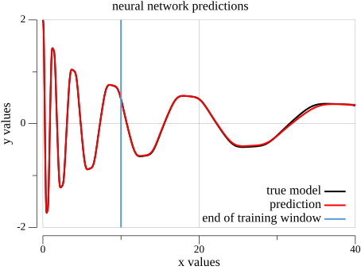

# Deep Learning Runge-Kutta (DL-RK4)

A project that combines **Deep Learning** with the **4th-Order Runge-Kutta (RK4) numerical integration method** to model and predict temporal dynamics of complex systems. This project uses Artificial Neural Networks (ANN) to learn derivative functions in dynamical systems and performs temporal integration for time-series forecasting and surrogate modeling.

The current repository is a compact Go implementation of the workflow:

1. Load state trajectories and their derivatives from CSV files.
2. Train a neural network to approximate the derivative function `dx/dt = f(x)`.
3. Use the trained neural network as the right-hand side of an ODE solver.
4. Integrate the learned dynamics with RK4.
5. Compare the reconstructed trajectory with the analytical/reference data.

This makes the project useful as a small surrogate-modeling example: the neural network learns the vector field, while the numerical method handles temporal propagation.

---

## 📋 Key Features

### 🔬 4th-Order Runge-Kutta Integration (RK4)
- Efficient implementation of the RK4 method for dynamical system integration
- Combines neural network predictions with numerical integration techniques
- Enables high-precision long-term trajectory forecasting
- Fixed-step RK4 solver with configurable time step
- Fourth-order accurate numerical integration (local error: O(h⁵), global error: O(h⁴))
- Implemented in `solver/rungekutta4.go`

### 🧠 Artificial Neural Network (ANN) Training
- Fully connected customizable architecture
- Activation function used in this project: **Tanh** (well suited for smooth ODE/vector-field learning)
- **Regression mode** for continuous value prediction
- L2 regularization to prevent overfitting
- Optimizer: **Adam** with configurable learning rates and bias correction
- Training utilities are provided by [`github.com/adynascimento/deep-learning`](https://github.com/adynascimento/deep-learning)
- The example trains the network directly on the loaded train split

### 🔍 Hyperparameter Optimization
- **Random Search**: Random search over parameter space
- Automatically tunes:
  - Number of hidden layers
  - Number of neurons per layer
  - Learning rate
  - L2 regularization parameter
- Saves trained models from each trial
- Automatically identifies optimal parameters

### 📊 Data Loading and Processing
- CSV data loading utilities
- Automatic train-test data splitting
- Support for multidimensional time-series data
- Dense matrix manipulation with Gonum
- The included dataset has two state variables and their corresponding derivatives

### 📈 Results Visualization
- Comparative plots: analytical data vs. neural network predictions
- Training window boundary markers
- PNG export functionality
- Interactive graph display

### 📉 Model Evaluation Metrics
- Mean Squared Error (MSE) on training and test datasets
- Per-feature integration error analysis
- Global integration error quantification

---

## 🎯 Usage Examples

### 1. Training and Prediction (Main Example)

The main example in `main.go` loads the included dataset, trains a neural network on the first part of the trajectory, integrates the learned derivative model over the full time window, and plots both state variables.

```go
// main.go
package main

import (
	"fmt"
	"runge-kutta/solver"

	network "github.com/adynascimento/deep-learning/neuralnetwork"
	"github.com/adynascimento/deep-learning/ngo"
	"github.com/adynascimento/plot/plotter"
	"gonum.org/v1/gonum/mat"
)

func main() {
	// loading data
	time := ngo.Linspace(0.0, 39.99, 4000)
	data := solver.LoadFromFile("solver/dataset/data.csv")
	derivativeData := solver.LoadFromFile("solver/dataset/derivative.csv")

	// training dimension used to mark the training window in the plot
	trainingDim := int(0.25 * float64(len(time)))

	// split data into training and testing dataset
	xTrain, xTest := ngo.Split(data, 0.25)
	yTrain, yTest := ngo.Split(derivativeData, 0.25)

	// input and output features
	inputDim := xTrain.RawMatrix().Rows
	outputDim := yTrain.RawMatrix().Rows

	// neural network model
	neural := network.NewNeuralNetwork(network.NeuralConfig{
		NNStructure: []int{inputDim, 45, outputDim},
		Activation:  network.TanhActivation,
		Mode:        network.ModeRegression,
	})

	// optimizer to train the model
	model := neural.NewTrainer(network.TrainerConfig{
		Optimizer:    network.AdamOptimizer,
		LearningRate: 0.001,
		Epochs:       20000},
		network.WithL2Regularization(1.40e-06))
	
	model.Fit(xTrain, yTrain, true)
	fmt.Printf("training dataset error: %.6e\n", model.Evaluate(xTrain, yTrain))
	fmt.Printf("testing dataset error:  %.6e\n", model.Evaluate(xTest, yTest))

	// temporal integration for predictions
	integratedPred := solver.SolveRK4(solver.Parameters{
		Func: model.Predict,
		X0:   mat.Col(nil, 0, xTrain),
		Tmax: time[len(time)-1],
		Step: time[1] - time[0],
	})

	// mean squared error
	metric := ngo.Scale(1./float64(data.RawMatrix().Cols),
		ngo.Sum(ngo.Square(ngo.Sub(data, integratedPred)), ngo.OverColumns))
	fmt.Println("global integration error by feature:")
	fmt.Printf("%.6e\n", mat.Formatted(metric))

	// plotting
	plt := plotter.NewSubplot(1, 2)
	plt.FigSize(23, 10)

	subplt := plt.Subplot(0, 0)
	subplt.Plot(time, mat.Row(nil, 0, data))
	subplt.Plot(time, mat.Row(nil, 0, integratedPred))
	subplt.Plot(ngo.Linspace(time[trainingDim], time[trainingDim], 10), ngo.Linspace(-2.0, 2.0, 10))
	subplt.Title("neural network predictions")
	subplt.XLabel("t values")
	subplt.YLabel("x1")
	subplt.Legend("analytical model", "model prediction", "end of training window")
	subplt.XLim(0.0, 40.0)
	subplt.Grid()

	subplt = plt.Subplot(0, 1)
	subplt.Grid()
	subplt.Plot(time, mat.Row(nil, 1, data))
	subplt.Plot(time, mat.Row(nil, 1, integratedPred))
	subplt.Plot(ngo.Linspace(time[trainingDim], time[trainingDim], 10), ngo.Linspace(-2.0, 2.0, 10))
	subplt.Title("neural network predictions")
	subplt.XLabel("t values")
	subplt.YLabel("x2")
	subplt.Legend("analytical model", "model prediction", "end of training window")
	subplt.XLim(0.0, 40.0)

	plt.Show()
	plt.Save("plot.png")
}
```

Example output plot:



**Use case**: Surrogate modeling of complex dynamics without explicit knowledge of governing differential equations. Ideal for scientific computing and physics-informed machine learning.

---

### 2. Hyperparameter Optimization

```go
// hyperopt/hyperopt.go
package main

import (
	"fmt"
	"runge-kutta/solver"
	"strconv"

	"github.com/adynascimento/deep-learning/hyperopt"
	network "github.com/adynascimento/deep-learning/neuralnetwork"
	"github.com/adynascimento/deep-learning/ngo"
)

func main() {
	// loading data
	data := solver.LoadFromFile("../solver/dataset/data.csv")
	derivativeData := solver.LoadFromFile("../solver/dataset/derivative.csv")

	//split data into training and testing dataset
	xTrain, xTest := ngo.Split(data, 0.25)
	yTrain, yTest := ngo.Split(derivativeData, 0.25)

	neuralNetworkModel := func(trialID int, params hyperopt.Params) float64 {
		// neural network model
		neural := network.NewNeuralNetwork(network.NeuralConfig{
			NNStructure: params.NNStructure,
			Activation:  network.TanhActivation,
			Mode:        network.ModeRegression,
		})

		// optimizer to train the model
		model := neural.NewTrainer(network.TrainerConfig{
			Optimizer:    network.AdamOptimizer,
			LearningRate: params.LearningRate,
			Epochs:       20000},
			network.WithL2Regularization(params.L2Regularization))
		model.Fit(xTrain, yTrain, true)
		model.Save("./trials/networkmodel" + strconv.Itoa(trialID) + ".json")

		// make predictions and evaluate model
		return model.Evaluate(xTest, yTest)
	}

	study := hyperopt.NewHyperparameterOptimization(
		hyperopt.SearchSpace{
			InputDim:          xTrain.RawMatrix().Rows,
			OutputDim:         yTrain.RawMatrix().Rows,
			NLayersRange:      []int{3, 5},
			NHiddenRange:      []int{30, 80},
			LearningRateRange: []float64{1e-4, 1e-2},
			LambdRange:        []float64{1e-6, 1e-2},
			NModels:           3,
		})

	study.RandomSearchOptimization(hyperopt.Minimize, neuralNetworkModel)
	fmt.Println("best params:", study.GetBestParams())
}
```

**Use case**: Automatically find the best network architecture and training parameters for your specific dynamical system.

---

## 📁 Project Structure

```
deep-learning-runge-kutta/
├── main.go                      # Main application: training and prediction pipeline
├── bestmodel.json               # Example trained neural network model committed with the project
├── bestplot.png                 # Example plot/output image committed with the project
├── go.mod                       # Go module dependencies
├── go.sum                       # Dependency lock/checksum file
├── README.md                    # This documentation
│
├── solver/                      # RK4 solver package with utilities
│   ├── rungekutta4.go           # 4th-Order Runge-Kutta implementation
│   ├── utils.go                 # Helper functions (data loading)
│   └── dataset/                 # Input data directory
│       ├── data.csv             # System state values (features)
│       └── derivative.csv       # System derivatives/ODEs
│
└── hyperopt/                    # Hyperparameter optimization package
    ├── hyperopt.go              # Random search optimization
    └── trials/                  # Saved models from optimization trials
        ├── networkmodel0.json
        ├── networkmodel1.json
        └── networkmodel2.json
```

---

## 🧾 Dataset Format

The included dataset is stored in `solver/dataset/`:

- `data.csv`: state values of the dynamical system.
- `derivative.csv`: derivative values associated with each state sample.

Each CSV row represents one time sample, and each column represents one state variable or derivative component. The loader in `solver/utils.go` converts this row-oriented CSV into a Gonum dense matrix with shape:

```text
features x samples
```

For the included files, each row has two values. After loading, the model sees a two-dimensional state vector and learns a two-dimensional derivative vector:

```text
x = [x1, x2]
dx/dt = [dx1/dt, dx2/dt]
```

The main program creates a time grid with:

```go
time := ngo.Linspace(0.0, 39.99, 4000)
```

That means the integration uses the same time interval and time step assumed by the example data. If you replace the dataset, make sure `time`, `Tmax`, and `Step` match the sampling of your own data.

---

## 🚀 Installation

### Prerequisites
- Go 1.22 or higher
- CSV datasets with:
  - Feature matrix file (system state values)
  - Derivative matrix file (corresponding derivatives/temporal changes)

### Steps

1. Clone the repository:
```bash
git clone https://github.com/adynascimento/deep-learning-runge-kutta.git
cd deep-learning-runge-kutta
```

2. Download dependencies:
```bash
go mod tidy
```

3. Run hyperparameter optimization from the `hyperopt` directory:
```bash
cd hyperopt
go run hyperopt.go
```

---

## 📦 Main Dependencies

- **Gonum**: Numerical computing in Go
- **Deep Learning** ([github.com/adynascimento/deep-learning](https://github.com/adynascimento/deep-learning)): Artificial Neural Networks (ANN), hyperparameter optimizations
- **Plot** ([github.com/adynascimento/plot](https://github.com/adynascimento/plot)): Graph visualization and plotting

---

## 🚀 Advanced Features

### Data-driven Modeling of Physical Systems

This project implements surrogate modeling using neural networks as function approximators for ODE systems:

```go
// the network learns to approximate the system's derivative function
// f(x) ≈ neural_network(x)
// Then RK4 uses this learned function for temporal integration

integratedPred := solver.SolveRK4(solver.Parameters{
	Func: model.Predict,  // neural network as ODE function
	X0:   initialState,
	Tmax: finalTime,
	Step: timeStep,
})
```

**When to use**: Complex systems where differential equations are unknown or computationally expensive, high-dimensional dynamics, real-time forecasting with pre-trained models.

---

### Data Preparation and Normalization

For many dynamical systems, normalizing the data before training can improve convergence and numerical stability:

```go
// feature standardization
applyNormalization := func(_, _ int, v float64) float64 { 
	return v / maxValue  // normalize to [0, 1] or [-1, 1]
}
data = ngo.Apply(applyNormalization, data)
derivatives = ngo.Apply(applyNormalization, derivatives)
```

---

## 🎓 Supported Concepts

### Activation Functions
- **Tanh**: Used by the current project; useful for smooth dynamics because it is bounded and differentiable
- **ReLU**: Common in many deep-learning tasks, but less smooth around zero
- **Sigmoid**: Useful for bounded outputs, though it can saturate for large magnitudes

### Optimizers
- **Adam**: Adapts learning rate per parameter with momentum and squared gradient tracking (recommended for RK4 projects)
- The current examples configure Adam with a fixed learning rate

### Regularization
- **L2 (Ridge)**: Penalizes large weights to prevent overfitting and improve generalization

### Training Modes
- **Regression**: MSE loss with linear output (suitable for derivative learning)

### Integration Methods
- **RK4**: Fourth-order Runge-Kutta (implemented in solver/rungekutta4.go)
- Configurable step size for accuracy vs. speed trade-off

---

## 🔧 Advanced Configuration

### Network Architecture Customization

```go
neural := network.NewNeuralNetwork(network.NeuralConfig{
	NNStructure: []int{inputDim, 64, 32, outputDim},  // adjust hidden layers
	Activation:  network.TanhActivation,
	Mode:        network.ModeRegression,
})
```

### Training Parameters

```go
model := neural.NewTrainer(network.TrainerConfig{
	Optimizer:    network.AdamOptimizer,
	LearningRate: 0.001,      // decrease for stability, increase for speed
	Epochs:       20000},     // more epochs for better convergence
	network.WithL2Regularization(1.40e-06))  // increase to prevent overfitting
```

### RK4 Integration Control

```go
integratedPred := solver.SolveRK4(solver.Parameters{
	Func: model.Predict,
	X0:   mat.Col(nil, 0, xTrain),
	Tmax: time[len(time)-1],
	Step: time[1] - time[0],  // smaller step = higher accuracy, slower computation
})
```

### Hyperparameter Search Space

```go
study := hyperopt.NewHyperparameterOptimization(
	hyperopt.SearchSpace{
		InputDim:          xTrain.RawMatrix().Rows,
		OutputDim:         yTrain.RawMatrix().Rows,
		NLayersRange:      []int{3, 5},           // min and max hidden layers
		NHiddenRange:      []int{30, 80},         // min and max neurons per layer
		LearningRateRange: []float64{1e-4, 1e-2},
		LambdRange:        []float64{1e-6, 1e-2},
		NModels:           10,                    // increase for more thorough search
	})
```

---

## 💡 Recommended Use Cases

| Task | Configuration | Example |
|------|---------------|----------|
| ODE surrogate modeling | ANN + RK4 | Lorenz system, pendulum dynamics |
| Data-driven modeling of physical systems | ANN derivative model + RK4 | Fluid dynamics approximation |
| Time-series forecasting | Longer training window | Climate model emulation |
| System identification | Hyperparameter optimization | Unknown dynamical systems |
| Real-time prediction | Pre-trained model + RK4 | Control system dynamics |

---

## 📝 License

This project is licensed under the MIT License. See the LICENSE file for details. All computational code follows standard open-source practices and is provided as-is.

---

## 🤝 Contributing

Contributions are welcome! Please open issues or pull requests for improvements.

---

## 📚 Additional Resources

- [Gonum Documentation](https://www.gonum.org/)
- [4th-Order Runge-Kutta](https://en.wikipedia.org/wiki/Runge%E2%80%93Kutta_methods)
- [Deep Learning with Go from Scratch](https://github.com/adynascimento/deep-learning)
- [Numerical Methods for ODEs](https://en.wikipedia.org/wiki/Numerical_methods_for_ordinary_differential_equations)
- [Hyperparameter Optimization](https://en.wikipedia.org/wiki/Hyperparameter_optimization)
- [Reduced Order Models Using Deep Feedforward Neural Networks](https://arxiv.org/abs/1903.05206)

---

**Learn and predict complex dynamical systems using neural networks and numerical integration in Go.**
