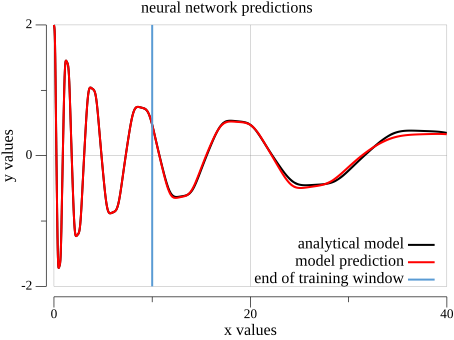

# Deep Learning Runge-Kutta (DL-RK4)

A project that combines **Deep Learning** with the **4th-Order Runge-Kutta (RK4) numerical integration method** to model and predict temporal dynamics of complex systems. This project uses Artificial Neural Networks (ANN) to learn derivative functions in dynamical systems and performs temporal integration for time-series forecasting and surrogate modeling.

The current repository is a compact Go implementation of the workflow:

1. Load state trajectories and their derivatives from CSV files.
2. Train a neural network to approximate the derivative function `dx/dt = f(x)`.
3. Use the trained neural network as the right-hand side of an ODE solver.
4. Integrate the learned dynamics with RK4.
5. Compare the reconstructed trajectory with the analytical/reference data.

This makes the project useful as a small surrogate-modeling example: the neural network learns the vector field, while the numerical method handles temporal propagation.

---

## 📋 Key Features

### 🔬 4th-Order Runge-Kutta Integration (RK4)
- Efficient implementation of the RK4 method for dynamical system integration
- Combines neural network predictions with numerical integration techniques
- Enables high-precision long-term trajectory forecasting
- Fixed-step RK4 solver with configurable time step
- Fourth-order accurate numerical integration (local error: O(h⁵), global error: O(h⁴))
- Implemented in `solver/rungekutta4.go`

### 🧠 Artificial Neural Network (ANN) Training
- Fully connected customizable architecture
- Activation function used in this project: **Tanh** (well suited for smooth ODE/vector-field learning)
- **Regression mode** for continuous value prediction
- L2 regularization to prevent overfitting
- Optimizer: **Adam** with configurable learning rates and bias correction
- Training utilities are provided by [`github.com/adynascimento/deep-learning`](https://github.com/adynascimento/deep-learning)
- The example trains the network directly on the loaded train split

### 🔍 Hyperparameter Optimization
- **Bayesian Optimization** over the hyperparameter space
- Automatically tunes:
  - Number of hidden layers
  - Number of neurons per layer
  - Learning rate
  - L2 regularization parameter
- Saves trained models from each trial
- Automatically identifies optimal parameters

### 📊 Data Loading and Processing
- CSV data loading utilities
- Automatic train-test data splitting
- Support for multidimensional time-series data
- Dense matrix manipulation with Gonum
- The included dataset has two state variables and their corresponding derivatives

### 📈 Results Visualization
- Comparative plots: analytical data vs. neural network predictions
- Training window boundary markers
- PNG export functionality
- Interactive graph display

### 📉 Model Evaluation Metrics
- Mean Squared Error (MSE) on training and test datasets
- Per-feature integration error analysis
- Global integration error quantification

---

## 🎯 Usage Examples

### 1. Training and Prediction (Main Example)

The main example in `main.go` loads the included dataset, trains a neural network on the first part of the trajectory, integrates the learned derivative model over the full time window, and plots both state variables.

```go
// main.go
package main

import (
	"fmt"
	"runge-kutta/solver"

	"github.com/adynascimento/deep-learning/mlp"
	"github.com/adynascimento/deep-learning/nncore"
	"github.com/adynascimento/deep-learning/ngo"
	"github.com/adynascimento/plot/plotter"
	"gonum.org/v1/gonum/mat"
)

func main() {
	// neural network model
	neural := mlp.NewNeuralNetwork(mlp.NeuralConfig{
		NNStructure: []int{inputDim, 45, outputDim},
		Activation:  nncore.TanhActivation,
		Mode:        nncore.ModeRegression,
	})

	// optimizer to train the model
	model := neural.NewTrainer(mlp.TrainerConfig{
		Optimizer:    nncore.AdamOptimizer,
		LearningRate: 0.001,
		Epochs:       10000},
		mlp.WithBatchSize(xTrain.RawMatrix().Rows),
		mlp.WithL2Regularization(1.40e-05),
	)
	
	model.Fit(xTrain, yTrain)

	// temporal integration for predictions
	integratedPred := solver.SolveRK4(solver.Parameters{
		Func: model.Predict,
		X0:   xTrain.RawRowView(0),
		Tmax: times[len(times)-1],
		Step: times[1] - times[0],
	})
}
```

Example output plot:



**Use case**: Surrogate modeling of complex dynamics without explicit knowledge of governing differential equations. Ideal for scientific computing and physics-informed machine learning.

---

### 2. Hyperparameter Optimization

```go
// hyperopt/hyperopt.go
package main

import (
	"fmt"
	"runge-kutta/solver"
	"strconv"

	"github.com/adynascimento/deep-learning/hyperopt"
	"github.com/adynascimento/deep-learning/mlp"
	"github.com/adynascimento/deep-learning/nncore"
	"github.com/adynascimento/deep-learning/ngo"
)

func main() {
	model := func(trialID int, params mlp.Params) float64 {
		nnStructure := []int{xTrain.RawMatrix().Cols}
		nnStructure = append(nnStructure, params.HiddenLayers...)
		nnStructure = append(nnStructure, yTrain.RawMatrix().Cols)

		neural := mlp.NewNeuralNetwork(mlp.NeuralConfig{
			NNStructure: nnStructure,
			Activation:  nncore.TanhActivation,
			Mode:        nncore.ModeRegression,
		})

		model := neural.NewTrainer(mlp.TrainerConfig{
			Optimizer:    nncore.AdamOptimizer,
			LearningRate: params.LearningRate,
			Epochs:       5000},
			mlp.WithL2Regularization(params.L2Regularization),
		)
		model.Fit(xTrain, yTrain, mlp.WithVerbose(false))
		model.Save("./trials/model" + strconv.Itoa(trialID) + ".json")

		return model.Evaluate(xTest, yTest)
	}

	study := mlp.NewHyperopt(mlp.SearchSpace{
		NHiddenLayersRange: mlp.IntRange{Min: 1, Max: 3},
		NHiddenRange:       mlp.IntRange{Min: 30, Max: 80},
		LearningRateRange:  mlp.FloatRange{Min: 1e-4, Max: 1e-2},
		L2Range:            mlp.FloatRange{Min: 1e-6, Max: 1e-2},
		NTrials:            3,
	})

	study.Optimize(hyperopt.Bayesian, hyperopt.Minimize, model)
}
```

**Use case**: Automatically find the best network architecture and training parameters for your specific dynamical system.

---


## 🧾 Dataset Format

The included dataset is stored in `solver/dataset/`:

- `data.csv`: state values of the dynamical system.
- `derivative.csv`: derivative values associated with each state sample.

Each CSV row represents one time sample, and each column represents one state variable or derivative component. The loader in `solver/utils.go` preserves this layout in a Gonum dense matrix with shape:

```text
(nSamples, nFeatures)
```

Rows represent time samples and columns represent state variables or derivative components. This is the samples-first convention used by the [`deep-learning`](https://github.com/adynascimento/deep-learning) library.

For the included files, each row has two values. After loading, the model sees a two-dimensional state vector and learns a two-dimensional derivative vector:

```text
x = [x1, x2]
dx/dt = [dx1/dt, dx2/dt]
```

The main program creates a time grid with:

```go
times := ngo.Linspace(0.0, 39.99, 4000)
```

That means the integration uses the same time interval and time step assumed by the example data. If you replace the dataset, make sure `times`, `Tmax`, and `Step` match the sampling of your own data.

---

## 🚀 Installation

### Prerequisites
- Go 1.25 or higher
- CSV datasets with:
  - Feature matrix file (system state values)
  - Derivative matrix file (corresponding derivatives/temporal changes)

### Steps

1. Clone the repository:
```bash
git clone https://github.com/adynascimento/deep-learning-runge-kutta.git
cd deep-learning-runge-kutta
```

2. Download dependencies:
```bash
go mod tidy
```

3. Train the model, integrate the learned dynamics, and generate `plot.png`:
```bash
go run .
```

4. Optionally run hyperparameter optimization from the `hyperopt` directory:
```bash
cd hyperopt
go run hyperopt.go
```

---

## 📦 Main Dependencies

- **Gonum**: Numerical computing in Go
- **Deep Learning** ([github.com/adynascimento/deep-learning](https://github.com/adynascimento/deep-learning)): Artificial Neural Networks (ANN), hyperparameter optimizations
- **Plot** ([github.com/adynascimento/plot](https://github.com/adynascimento/plot)): Graph visualization and plotting

---

## 🚀 Advanced Features

### Data-driven Modeling of Physical Systems

This project implements surrogate modeling using neural networks as function approximators for ODE systems:

```go
// the network learns to approximate the system's derivative function
// f(x) ≈ neural_network(x)
// Then RK4 uses this learned function for temporal integration

integratedPred := solver.SolveRK4(solver.Parameters{
	Func: model.Predict,  // neural network as ODE function
	X0:   initialState,
	Tmax: finalTime,
	Step: timeStep,
})
```

**When to use**: Complex systems where differential equations are unknown or computationally expensive, high-dimensional dynamics, real-time forecasting with pre-trained models.

---

### Data Preparation and Normalization

For many dynamical systems, normalizing the data before training can improve convergence and numerical stability:

```go
// feature standardization
applyNormalization := func(_, _ int, v float64) float64 { 
	return v / maxValue  // normalize to [0, 1] or [-1, 1]
}
data = ngo.Apply(applyNormalization, data)
derivatives = ngo.Apply(applyNormalization, derivatives)
```

---

## 🎓 Supported Concepts

### Activation Functions
- **Tanh**: Used by the current project; useful for smooth dynamics because it is bounded and differentiable
- **ReLU**: Common in many deep-learning tasks, but less smooth around zero
- **Sigmoid**: Useful for bounded outputs, though it can saturate for large magnitudes

### Optimizers
- **Adam**: Adapts learning rate per parameter with momentum and squared gradient tracking (recommended for RK4 projects)
- The current examples configure Adam with a fixed learning rate

### Regularization
- **L2 (Ridge)**: Penalizes large weights to prevent overfitting and improve generalization

### Training Modes
- **Regression**: MSE loss with linear output (suitable for derivative learning)

### Integration Methods
- **RK4**: Fourth-order Runge-Kutta (implemented in solver/rungekutta4.go)
- Configurable step size for accuracy vs. speed trade-off

---

## 🔧 Advanced Configuration

### Network Architecture Customization

```go
neural := mlp.NewNeuralNetwork(mlp.NeuralConfig{
	NNStructure: []int{inputDim, 64, 32, outputDim},  // adjust hidden layers
	Activation:  nncore.TanhActivation,
	Mode:        nncore.ModeRegression,
})
```

### Training Parameters

```go
model := neural.NewTrainer(mlp.TrainerConfig{
	Optimizer:    nncore.AdamOptimizer,
	LearningRate: 0.001,                    // decrease for stability, increase for speed
	Epochs:       10000},                   // more epochs for better convergence
	mlp.WithL2Regularization(1.40e-05),     // increase to prevent overfitting
)  
```

### RK4 Integration Control

```go
integratedPred := solver.SolveRK4(solver.Parameters{
	Func: model.Predict,
	X0:   xTrain.RawRowView(0),
	Tmax: times[len(times)-1],
	Step: times[1] - times[0],  // smaller step = higher accuracy, slower computation
})
```

### Hyperparameter Search Space

```go
study := mlp.NewHyperopt(mlp.SearchSpace{
	NHiddenLayersRange: mlp.IntRange{Min: 1, Max: 3},
	NHiddenRange:       mlp.IntRange{Min: 30, Max: 80},
	LearningRateRange:  mlp.FloatRange{Min: 1e-4, Max: 1e-2},
	L2Range:            mlp.FloatRange{Min: 1e-6, Max: 1e-2},
	NTrials:            10, // increase for a more thorough search
})
```

---

## 💡 Recommended Use Cases

| Task | Configuration | Example |
|------|---------------|----------|
| ODE surrogate modeling | ANN + RK4 | Lorenz system, pendulum dynamics |
| Data-driven modeling of physical systems | ANN derivative model + RK4 | Fluid dynamics approximation |
| Time-series forecasting | Longer training window | Climate model emulation |
| System identification | Hyperparameter optimization | Unknown dynamical systems |
| Real-time prediction | Pre-trained model + RK4 | Control system dynamics |

---

## 🤝 Contributing

Contributions are welcome! Please open issues or pull requests for improvements.

---

## 📚 Additional Resources

- [Gonum Documentation](https://www.gonum.org/)
- [4th-Order Runge-Kutta](https://en.wikipedia.org/wiki/Runge%E2%80%93Kutta_methods)
- [Deep Learning with Go from Scratch](https://github.com/adynascimento/deep-learning)
- [Numerical Methods for ODEs](https://en.wikipedia.org/wiki/Numerical_methods_for_ordinary_differential_equations)
- [Hyperparameter Optimization](https://en.wikipedia.org/wiki/Hyperparameter_optimization)
- [Reduced Order Models Using Deep Feedforward Neural Networks](https://arxiv.org/abs/1903.05206)

---

**Learn and predict complex dynamical systems using neural networks and numerical integration in Go.**
